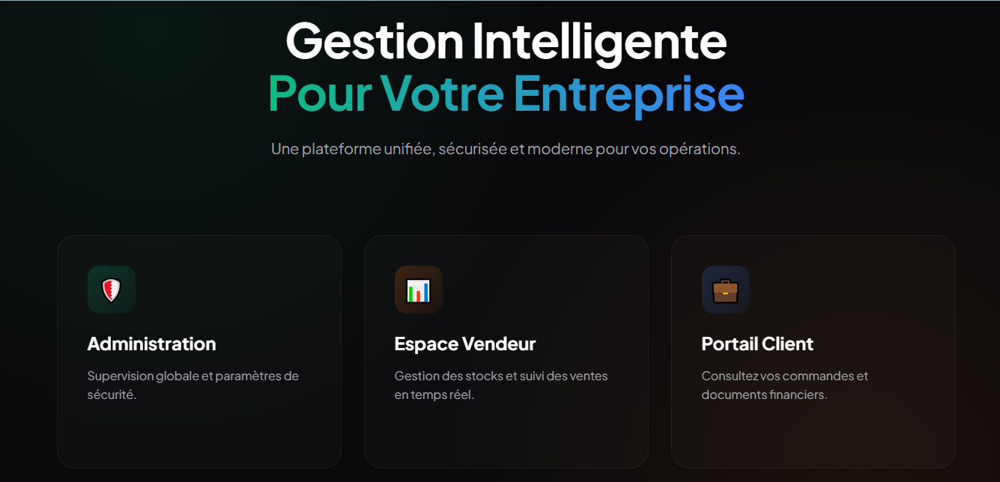
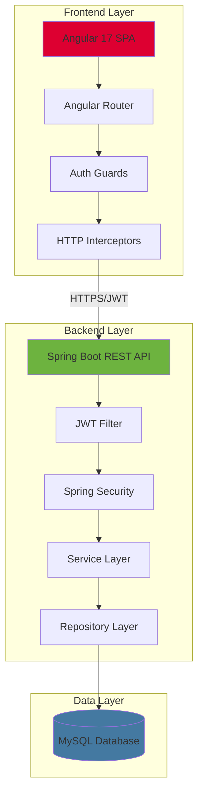

# 🔐 Secure Invoice Management System



<div align="center">

[](https://spring.io/projects/spring-boot)
[](https://angular.io/)
[](https://www.mysql.com/)
[](https://jwt.io/)
[](https://owasp.org/)
[](LICENSE)

**A cutting-edge enterprise application demonstrating secure full-stack development**

[Features](#-key-features) • [Demo](#-screenshots) • [Installation](#-getting-started) • [Documentation](#-api-documentation) • [Security](#-security-features)

</div>

---

## 🌟 Project Overview

An **enterprise-grade Invoice Management System** that combines modern web technologies with **military-grade security** practices. Built with **Spring Boot 3.2** and **Angular 17**, this application showcases professional software architecture, implementing **JWT authentication**, **role-based access control**, and comprehensive protection against **OWASP Top 10** vulnerabilities.

### 🎯 Why This Project Stands Out

- ✨ **Production-Ready**: Enterprise architecture with scalability in mind
- 🔐 **Security-First**: OWASP compliant with JWT, BCrypt, and RBAC
- 🎨 **Modern Stack**: Latest versions of Spring Boot & Angular
- 📊 **Real-Time Analytics**: Dynamic dashboards with Chart.js
- 🧪 **Test Coverage**: Comprehensive unit and integration tests
- 🐳 **Containerized**: Ready for Docker deployment
- 📚 **Well Documented**: Clear API docs and code comments

---

## ✨ Key Features

<table>
<tr>
<td width="50%">

### 💼 Business Capabilities

- 📄 **Complete Invoice Lifecycle**
  - Create, read, update, delete invoices
  - Real-time calculation of totals
  - PDF generation and export
  
- 👥 **Client Management**
  - Full CRUD operations
  - Search and filter capabilities
  - Client history tracking

- 📦 **Product Catalog**
  - Inventory management
  - Pricing controls
  - Category organization

- 📊 **Analytics Dashboard**
  - Sales statistics
  - Revenue tracking
  - Visual charts and graphs

</td>
<td width="50%">

### 🔒 Security Arsenal

- 🛡️ **Authentication**
  - JWT token-based auth
  - Stateless session management
  - Token refresh mechanism
  
- 🔐 **Authorization**
  - Role-based access control (RBAC)
  - Method-level security
  - Dynamic permission checking

- 🚫 **Threat Protection**
  - SQL Injection prevention
  - XSS mitigation
  - CSRF protection
  - IDOR prevention
  - Mass assignment protection

- 📝 **Audit & Monitoring**
  - Complete activity logging
  - Security event tracking
  - Anomaly detection ready

</td>
</tr>
</table>

---

## 🛠 Technology Stack

<div align="center">

### Backend Technologies


### Frontend Technologies


### DevOps & Tools


</div>

---

## 🏗 System Architecture

<div align="center">



</div>

### 🎯 Layered Architecture

| Layer | Components | Responsibility |
|-------|-----------|----------------|
| **Presentation** | Angular Components, Templates | User interface, UX |
| **API** | REST Controllers, DTOs | Request handling, validation |
| **Business Logic** | Services, Business rules | Core functionality |
| **Data Access** | Repositories, JPA Entities | Database operations |
| **Security** | JWT Filters, Auth Services | Authentication, authorization |
| **Database** | MySQL Tables, Relationships | Data persistence |

---

## 👥 User Roles & Permissions

<table>
<tr>
<th width="33%">🔴 ADMIN</th>
<th width="33%">🟢 VENDEUR</th>
<th width="33%">🔵 CLIENT</th>
</tr>
<tr>
<td valign="top">

**System Administrator**

- ✅ Full system access
- 📊 View all statistics
- 👥 User management
- 🔒 Security monitoring
- 📈 Audit logs access
- ⚙️ System configuration
- 🗑️ Delete any records

</td>
<td valign="top">

**Sales Representative**

- 📄 Manage invoices
- 👤 Manage clients
- 📦 Manage products
- 💰 View sales stats
- 📑 Generate PDFs
- 🔍 Search records
- ✏️ Edit own data

</td>
<td valign="top">

**Customer**

- 👀 View products
- 📜 View own invoices
- 💳 Download invoices
- 📊 View account info
- 🔍 Search products
- 👤 Update profile
- ❌ Read-only access

</td>
</tr>
</table>

---

## 🔐 Security Implementation

### 🛡️ Defense in Depth Strategy

```
┌─────────────────────────────────────────────────────────────┐
│                     Frontend Security                        │
│  • Input Validation  • XSS Prevention  • CORS Headers       │
└──────────────────────┬──────────────────────────────────────┘
                       │
                       ▼
┌─────────────────────────────────────────────────────────────┐
│                    Transport Security                        │
│  • HTTPS/TLS  • JWT Tokens  • Secure Headers               │
└──────────────────────┬──────────────────────────────────────┘
                       │
                       ▼
┌─────────────────────────────────────────────────────────────┐
│                   Application Security                       │
│  • Authentication  • Authorization  • Session Management    │
└──────────────────────┬──────────────────────────────────────┘
                       │
                       ▼
┌─────────────────────────────────────────────────────────────┐
│                      Data Security                           │
│  • Encryption  • Prepared Statements  • Access Control     │
└─────────────────────────────────────────────────────────────┘
```

### 🎯 OWASP Top 10 Protection

| # | Vulnerability | Implementation | Status |
|---|--------------|----------------|--------|
| A01 | Broken Access Control | JWT + RBAC + Method Security | ✅ Protected |
| A02 | Cryptographic Failures | BCrypt + HTTPS + Secure Storage | ✅ Protected |
| A03 | Injection | JPA/Hibernate + Input Validation | ✅ Protected |
| A04 | Insecure Design | Security-first architecture | ✅ Protected |
| A05 | Security Misconfiguration | Secure defaults + Updates | ✅ Protected |
| A06 | Vulnerable Components | Dependency scanning | ✅ Protected |
| A07 | Authentication Failures | Strong policies + JWT | ✅ Protected |
| A08 | Software Integrity Failures | Code signing + CI/CD | ✅ Protected |
| A09 | Logging Failures | Comprehensive logging | ✅ Protected |
| A10 | SSRF | URL validation + Whitelist | ✅ Protected |

### 🔑 JWT Authentication Flow

```
┌──────────┐                                          ┌──────────┐
│          │  1. POST /api/auth/login                │          │
│  Client  │────────────────────────────────────────>│  Server  │
│          │     {username, password}                │          │
└──────────┘                                          └──────────┘
                                                           │
                                                           │ 2. Validate
                                                           │    Credentials
                                                           ▼
┌──────────┐                                          ┌──────────┐
│          │  3. Return JWT Token + User Info        │          │
│  Client  │<────────────────────────────────────────│  Server  │
│          │     {token, user, role}                 │          │
└──────────┘                                          └──────────┘
     │
     │ 4. Store JWT
     │    in localStorage
     ▼
┌──────────┐                                          ┌──────────┐
│          │  5. Authenticated Requests              │          │
│  Client  │────────────────────────────────────────>│  Server  │
│          │     Header: "Bearer {JWT}"              │          │
└──────────┘                                          └──────────┘
                                                           │
                                                           │ 6. Validate
                                                           │    JWT Token
                                                           │
                                                           │ 7. Check
                                                           │    Permissions
                                                           ▼
┌──────────┐                                          ┌──────────┐
│          │  8. Return Protected Resource           │          │
│  Client  │<────────────────────────────────────────│  Server  │
│          │                                          │          │
└──────────┘                                          └──────────┘
```

---

## 📸 Application Screenshots

> 📁 **Note**: To add screenshots, place images in `docs/images/dashboards/` directory

### 🔴 Admin Dashboard
*Complete system overview with real-time statistics and security monitoring*


**Features shown:**
- Real-time system statistics
- User activity monitoring
- Security alerts dashboard
- Revenue analytics charts

---

### 🟢 Vendeur Dashboard
*Comprehensive invoice and client management interface*


**Features shown:**
- Invoice creation wizard
- Client management table
- Product catalog view
- Sales performance metrics

---

### 🔵 Client Dashboard
*User-friendly product catalog and invoice history*


**Features shown:**
- Browse product catalog
- View invoice history
- Download PDF invoices
- Account information

---

## 🎬 Live Demonstrations

> 🎥 **Note**: GIF animations go in `docs/images/animations/` directory

### 🔐 Secure Login Flow


### 📄 Invoice Creation Process


### 🛡️ Admin Security Monitoring


---

## 🚀 Getting Started

### 📋 Prerequisites

Ensure you have the following installed:

- ☕ **Java JDK 17+** - [Download](https://adoptium.net/)
- 📦 **Node.js 18+** & npm - [Download](https://nodejs.org/)
- 🗄️ **MySQL 8.0+** - [Download](https://dev.mysql.com/downloads/)
- 🔧 **Maven 3.8+** - [Download](https://maven.apache.org/download.cgi)
- ⚡ **Angular CLI** - Install via: `npm install -g @angular/cli`

### ⚙️ Installation Steps

#### 1️⃣ Clone the Repository

```bash
git clone https://github.com/LAAOUAFIFATIHA/Spring-Boot-Security-Invoice-Management-.git
cd Spring-Boot-Security-Invoice-Management-
```

#### 2️⃣ Database Configuration

```sql
-- Create database
CREATE DATABASE invoice_management CHARACTER SET utf8mb4 COLLATE utf8mb4_unicode_ci;

-- Create user
CREATE USER 'invoice_user'@'localhost' IDENTIFIED BY 'SecurePassword123!';

-- Grant privileges
GRANT ALL PRIVILEGES ON invoice_management.* TO 'invoice_user'@'localhost';
FLUSH PRIVILEGES;
```

#### 3️⃣ Backend Setup

```bash
cd backend

# Update application.properties with your database credentials
# src/main/resources/application.properties

# Install dependencies and build
mvn clean install

# Run the application
mvn spring-boot:run
```

🌐 Backend API will be available at: **http://localhost:8080**

**Verify backend is running:**
```bash
curl http://localhost:8080/actuator/health
# Should return: {"status":"UP"}
```

#### 4️⃣ Frontend Setup

```bash
cd frontend

# Install dependencies
npm install

# Start development server
ng serve

# Or for production build
ng build --configuration production
```

🌐 Frontend will be available at: **http://localhost:4200**

---

### 🐳 Docker Deployment

For a quick deployment using Docker:

```bash
# Build and start all services
docker-compose up --build

# Run in detached mode
docker-compose up -d

# Stop all services
docker-compose down

# View logs
docker-compose logs -f
```

**Services:**
- 🌐 Frontend: http://localhost:4200
- ⚙️ Backend: http://localhost:8080
- 🗄️ MySQL: localhost:3306

---

### 👤 Default Test Users

| Email | Password | Role | Access Level |
|-------|----------|------|-------------|
| admin@invoice.com | Admin@123 | ADMIN | Full system access |
| seller@invoice.com | Seller@123 | VENDEUR | Invoice & client management |
| client@invoice.com | Client@123 | CLIENT | Read-only product access |

> ⚠️ **Security Notice**: Change these credentials immediately in production!

---

## 📚 API Documentation

### 🔐 Authentication Endpoints

<details>
<summary><b>POST /api/auth/register</b> - Register new user</summary>

```json
Request:
{
  "username": "newuser@example.com",
  "password": "SecurePass123!",
  "role": "CLIENT"
}

Response:
{
  "id": 1,
  "username": "newuser@example.com",
  "role": "CLIENT",
  "createdAt": "2024-01-20T10:30:00"
}
```
</details>

<details>
<summary><b>POST /api/auth/login</b> - User login</summary>

```json
Request:
{
  "username": "seller@invoice.com",
  "password": "Seller@123"
}

Response:
{
  "token": "eyJhbGciOiJIUzI1NiIsInR5cCI6IkpXVCJ9...",
  "type": "Bearer",
  "user": {
    "id": 2,
    "username": "seller@invoice.com",
    "role": "VENDEUR"
  }
}
```
</details>

### 📄 Invoice Endpoints

| Method | Endpoint | Description | Access |
|--------|----------|-------------|--------|
| GET | `/api/invoices` | Get all invoices | ADMIN, VENDEUR |
| GET | `/api/invoices/{id}` | Get invoice by ID | ADMIN, VENDEUR, owner |
| POST | `/api/invoices` | Create new invoice | VENDEUR |
| PUT | `/api/invoices/{id}` | Update invoice | VENDEUR |
| DELETE | `/api/invoices/{id}` | Delete invoice | ADMIN, VENDEUR |
| GET | `/api/invoices/pdf/{id}` | Generate PDF | ADMIN, VENDEUR, owner |
| GET | `/api/invoices/client/{clientId}` | Get client invoices | VENDEUR, owner |

### 👥 Client Endpoints

| Method | Endpoint | Description | Access |
|--------|----------|-------------|--------|
| GET | `/api/clients` | Get all clients | ADMIN, VENDEUR |
| GET | `/api/clients/{id}` | Get client by ID | ADMIN, VENDEUR |
| POST | `/api/clients` | Create client | VENDEUR |
| PUT | `/api/clients/{id}` | Update client | VENDEUR |
| DELETE | `/api/clients/{id}` | Delete client | ADMIN, VENDEUR |
| GET | `/api/clients/search?name={name}` | Search clients | VENDEUR |

### 📦 Product Endpoints

| Method | Endpoint | Description | Access |
|--------|----------|-------------|--------|
| GET | `/api/products` | Get all products | ALL |
| GET | `/api/products/{id}` | Get product by ID | ALL |
| POST | `/api/products` | Create product | VENDEUR |
| PUT | `/api/products/{id}` | Update product | VENDEUR |
| DELETE | `/api/products/{id}` | Delete product | ADMIN, VENDEUR |

### 📊 Statistics Endpoints

| Method | Endpoint | Description | Access |
|--------|----------|-------------|--------|
| GET | `/api/stats/dashboard` | Dashboard statistics | ADMIN |
| GET | `/api/stats/revenue` | Revenue analytics | ADMIN, VENDEUR |
| GET | `/api/stats/clients` | Client statistics | ADMIN, VENDEUR |

### 🧪 Example API Calls

```bash
# Login
curl -X POST http://localhost:8080/api/auth/login \
  -H "Content-Type: application/json" \
  -d '{
    "username": "seller@invoice.com",
    "password": "Seller@123"
  }'

# Create Invoice
curl -X POST http://localhost:8080/api/invoices \
  -H "Content-Type: application/json" \
  -H "Authorization: Bearer YOUR_JWT_TOKEN" \
  -d '{
    "clientId": 1,
    "items": [
      {"productId": 1, "quantity": 2, "unitPrice": 100.00},
      {"productId": 2, "quantity": 1, "unitPrice": 50.00}
    ],
    "tax": 15.5,
    "discount": 10.0
  }'

# Get All Products
curl -X GET http://localhost:8080/api/products \
  -H "Authorization: Bearer YOUR_JWT_TOKEN"

# Generate Invoice PDF
curl -X GET http://localhost:8080/api/invoices/pdf/1 \
  -H "Authorization: Bearer YOUR_JWT_TOKEN" \
  --output invoice.pdf
```

---

## 🧪 Testing

### Backend Testing

```bash
cd backend

# Run all tests
mvn test

# Run with coverage
mvn test jacoco:report

# Integration tests
mvn verify

# Run specific test class
mvn test -Dtest=InvoiceServiceTest

# View coverage report
open target/site/jacoco/index.html
```

### Frontend Testing

```bash
cd frontend

# Unit tests
npm test

# Unit tests with coverage
npm test -- --code-coverage

# E2E tests
npm run e2e

# View coverage report
open coverage/invoice-frontend/index.html
```

### Security Testing

```bash
# OWASP Dependency Check
mvn org.owasp:dependency-check-maven:check

# Static code analysis
mvn sonar:sonar

# Security headers check
curl -I http://localhost:8080/api/invoices
```

---

## 📁 Project Structure

```
Spring-Boot-Security-Invoice-Management-/
│
├── 📁 backend/                          # Spring Boot Backend
│   ├── 📁 src/
│   │   ├── 📁 main/
│   │   │   ├── 📁 java/com/example/invoicemanagement/
│   │   │   │   ├── 📁 config/           # Security & Configuration
│   │   │   │   │   ├── SecurityConfig.java
│   │   │   │   │   ├── CorsConfig.java
│   │   │   │   │   └── WebConfig.java
│   │   │   │   │
│   │   │   │   ├── 📁 controller/       # REST Controllers
│   │   │   │   │   ├── AuthController.java
│   │   │   │   │   ├── InvoiceController.java
│   │   │   │   │   ├── ClientController.java
│   │   │   │   │   └── ProductController.java
│   │   │   │   │
│   │   │   │   ├── 📁 dto/              # Data Transfer Objects
│   │   │   │   │   ├── LoginRequest.java
│   │   │   │   │   ├── JwtResponse.java
│   │   │   │   │   └── InvoiceDTO.java
│   │   │   │   │
│   │   │   │   ├── 📁 entity/           # JPA Entities
│   │   │   │   │   ├── User.java
│   │   │   │   │   ├── Invoice.java
│   │   │   │   │   ├── Client.java
│   │   │   │   │   ├── Product.java
│   │   │   │   │   └── InvoiceItem.java
│   │   │   │   │
│   │   │   │   ├── 📁 repository/       # Data Access Layer
│   │   │   │   │   ├── UserRepository.java
│   │   │   │   │   ├── InvoiceRepository.java
│   │   │   │   │   ├── ClientRepository.java
│   │   │   │   │   └── ProductRepository.java
│   │   │   │   │
│   │   │   │   ├── 📁 security/         # Security Components
│   │   │   │   │   ├── JwtUtil.java
│   │   │   │   │   ├── JwtFilter.java
│   │   │   │   │   └── MyUserDetailsService.java
│   │   │   │   │
│   │   │   │   └── 📁 service/          # Business Logic
│   │   │   │       ├── AuthService.java
│   │   │   │       ├── InvoiceService.java
│   │   │   │       ├── ClientService.java
│   │   │   │       └── ProductService.java
│   │   │   │
│   │   │   └── 📁 resources/
│   │   │       ├── application.properties
│   │   │       ├── application-dev.properties
│   │   │       └── application-prod.properties
│   │   │
│   │   └── 📁 test/                     # Test Classes
│   │       └── 📁 java/com/example/invoicemanagement/
│   │           ├── InvoiceServiceTest.java
│   │           └── SecurityConfigTest.java
│   │
│   └── pom.xml                          # Maven Dependencies
│
├── 📁 frontend/                         # Angular Frontend
│   ├── 📁 src/
│   │   ├── 📁 app/
│   │   │   ├── 📁 components/           # UI Components
│   │   │   │   ├── 📁 admin-dashboard/
│   │   │   │   ├── 📁 vendeur-dashboard/
│   │   │   │   ├── 📁 client-dashboard/
│   │   │   │   ├── 📁 login/
│   │   │   │   ├── 📁 invoice-list/
│   │   │   │   ├── 📁 invoice-form/
│   │   │   │   ├── 📁 client-list/
│   │   │   │   └── 📁 product-list/
│   │   │   │
│   │   │   ├── 📁 services/             # HTTP Services
│   │   │   │   ├── auth.service.ts
│   │   │   │   ├── invoice.service.ts
│   │   │   │   ├── client.service.ts
│   │   │   │   └── product.service.ts
│   │   │   │
│   │   │   ├── 📁 guards/               # Route Guards
│   │   │   │   ├── auth.guard.ts
│   │   │   │   ├── admin.guard.ts
│   │   │   │   └── vendeur.guard.ts
│   │   │   │
│   │   │   ├── 📁 interceptors/         # HTTP Interceptors
│   │   │   │   ├── jwt.interceptor.ts
│   │   │   │   └── error.interceptor.ts
│   │   │   │
│   │   │   ├── 📁 models/               # TypeScript Models
│   │   │   │   ├── user.model.ts
│   │   │   │   ├── invoice.model.ts
│   │   │   │   ├── client.model.ts
│   │   │   │   └── product.model.ts
│   │   │   │
│   │   │   ├── app-routing.module.ts
│   │   │   ├── app.component.ts
│   │   │   └── app.module.ts
│   │   │
│   │   ├── 📁 assets/                   # Static Assets
│   │   │   ├── 📁 images/
│   │   │   └── 📁 styles/
│   │   │
│   │   ├── 📁 environments/             # Environment Configs
│   │   │   ├── environment.ts
│   │   │   └── environment.prod.ts
│   │   │
│   │   └── index.html
│   │
│   ├── angular.json
│   ├── package.json
│   └── tsconfig.json
│
├── 📁 docs/                             # Documentation
│   ├── 📁 images/
│   │   ├── 📁 dashboards/               # Screenshot images
│   │   ├── 📁 animations/               # GIF animations
│   │   └── 📁 security/                 # Security diagrams
│   │
│   ├── 📁 architecture/                 # Architecture diagrams
│   │   ├── backend-architecture.png
│   │   ├── frontend-architecture.png
│   │   └── database-schema.png
│   │
│   └── 📁 reports/                      # Analysis reports
│       ├── security-analysis.md
│       └── vulnerability-report.md
│
├── 📁 docker/                           # Docker Configuration
│   ├── docker-compose.yml
│   ├── Dockerfile.backend
│   └── Dockerfile.frontend
│
├── 📄 .gitignore
├── 📄 README.md                         # This file
├── 📄 LICENSE
└── 📄 IMAGE_PLACEMENT_GUIDE.md          # Image setup guide
```

---

## 🤝 Contributing

We welcome contributions! Here's how you can help:

### 🐛 Report Bugs
Open an issue describing the bug with:
- Steps to reproduce
- Expected behavior
- Actual behavior
- Screenshots if applicable

### 💡 Suggest Features
Open an issue tagged with `enhancement` explaining:
- The feature description
- Use cases
- Potential implementation approach

### 🔧 Submit Pull Requests

1. Fork the repository
2. Create your feature branch
   ```bash
   git checkout -b feature/AmazingFeature
   ```
3. Commit your changes
   ```bash
   git commit -m 'Add: Amazing new feature'
   ```
4. Push to the branch
   ```bash
   git push origin feature/AmazingFeature
   ```
5. Open a Pull Request

### 📝 Code Standards

- **Java**: Follow Google Java Style Guide
- **TypeScript**: Follow Angular style guide
- **Commits**: Use conventional commits (feat:, fix:, docs:, etc.)
- **Tests**: Write tests for new features
- **Documentation**: Update relevant docs

---

## 📖 Academic & Professional Context

### 🎓 Educational Value

This project demonstrates:

- ✅ **Software Architecture**: Layered architecture with clear separation of concerns
- ✅ **Security Engineering**: Practical implementation of security principles
- ✅ **Full-Stack Development**: Integration of frontend and backend technologies
- ✅ **Database Design**: Normalized schema with proper relationships
- ✅ **API Design**: RESTful principles and best practices
- ✅ **Testing Strategies**: Unit, integration, and E2E testing
- ✅ **DevOps Practices**: Containerization and CI/CD pipelines

### 💼 Industry Relevance

- 🏢 **Enterprise Patterns**: Uses patterns found in production systems
- 🔐 **Security Focus**: Addresses real-world security concerns
- 📊 **Scalability**: Architecture designed for growth
- 🧪 **Quality Assurance**: Comprehensive testing approach
- 📚 **Documentation**: Professional-level documentation

### 🎯 Learning Outcomes

After studying this project, you will understand:

1. **JWT Authentication** - Token-based security implementation
2. **Role-Based Access Control** - Fine-grained permission systems
3. **RESTful API Design** - Best practices for API development
4. **Angular Architecture** - Component-based frontend development
5. **Spring Boot** - Enterprise Java application development
6. **Security Best Practices** - OWASP Top 10 mitigation strategies
7. **Database Relationships** - JPA/Hibernate entity mapping
8. **Docker Deployment** - Containerization strategies

---

## 🔍 Security Analysis & Compliance

### ✅ Security Checklist

- [x] JWT authentication with secure token generation
- [x] BCrypt password hashing (cost factor: 12)
- [x] Role-based access control on all endpoints
- [x] Input validation on all user inputs
- [x] SQL injection prevention via JPA
- [x] XSS prevention via Angular sanitization
- [x] CSRF protection through stateless JWT
- [x] CORS configuration with whitelist
- [x] HTTPS enforcement in production
- [x] Secure password policy (min 8 chars, complexity)
- [x] Account lockout after failed login attempts
- [x] Audit logging for sensitive operations
- [x] Regular dependency updates
- [x] Error messages don't leak sensitive info

### 📊 Compliance

This application implements security controls aligned with:

- ✅ OWASP Top 10 (2021)
- ✅ GDPR principles (data protection)
- ✅ PCI DSS guidelines (where applicable)
- ✅ ISO 27001 best practices

---

## 📝 License

This project is licensed under the **MIT License**.

```
MIT License

Copyright (c) 2024 LAAOUAFI FATIHA

Permission is hereby granted, free of charge, to any person obtaining a copy
of this software and associated documentation files (the "Software"), to deal
in the Software without restriction, including without limitation the rights
to use, copy, modify, merge, publish, distribute, sublicense, and/or sell
copies of the Software, and to permit persons to whom the Software is
furnished to do so, subject to the following conditions:

The above copyright notice and this permission notice shall be included in all
copies or substantial portions of the Software.

THE SOFTWARE IS PROVIDED "AS IS", WITHOUT WARRANTY OF ANY KIND, EXPRESS OR
IMPLIED, INCLUDING BUT NOT LIMITED TO THE WARRANTIES OF MERCHANTABILITY,
FITNESS FOR A PARTICULAR PURPOSE AND NONINFRINGEMENT. IN NO EVENT SHALL THE
AUTHORS OR COPYRIGHT HOLDERS BE LIABLE FOR ANY CLAIM, DAMAGES OR OTHER
LIABILITY, WHETHER IN AN ACTION OF CONTRACT, TORT OR OTHERWISE, ARISING FROM,
OUT OF OR IN CONNECTION WITH THE SOFTWARE OR THE USE OR OTHER DEALINGS IN THE
SOFTWARE.
```

See the [LICENSE](LICENSE) file for full details.

---

## 👨‍💻 Author

<div align="center">

### **LAAOUAFI FATIHA**

[](https://github.com/LAAOUAFIFATIHA)
[](https://linkedin.com/in/yourprofile)
[](mailto:your.email@example.com)

**Computer Science Student | Full-Stack Developer | Security Enthusiast**

</div>

---

## 🙏 Acknowledgments

Special thanks to:

- 🍃 **Spring Boot Team** - For the excellent framework and documentation
- 🅰️ **Angular Team** - For the powerful frontend framework
- 🔒 **OWASP Foundation** - For security guidelines and best practices
- 🐳 **Docker Community** - For containerization tools
- 💾 **MySQL Team** - For the robust database system
- 🌐 **Open Source Community** - For countless libraries and tools
- 👨‍🏫 **Educators & Mentors** - For guidance and feedback

---

## 📞 Support & Contact

<div align="center">

### Need Help?

| Type | Link |
|------|------|
| 🐛 Report a Bug | [GitHub Issues](https://github.com/LAAOUAFIFATIHA/Spring-Boot-Security-Invoice-Management-/issues/new?labels=bug) |
| 💡 Request Feature | [GitHub Issues](https://github.com/LAAOUAFIFATIHA/Spring-Boot-Security-Invoice-Management-/issues/new?labels=enhancement) |
| 💬 Ask Question | [GitHub Discussions](https://github.com/LAAOUAFIFATIHA/Spring-Boot-Security-Invoice-Management-/discussions) |
| 📧 Email | your.email@example.com |

</div>

---

## 📈 Project Stats

<div align="center">


</div>

---

<div align="center">

## ⭐ Show Your Support

If you found this project helpful or learned something from it, please consider giving it a **star** ⭐

It helps others discover the project and motivates continued development!

[](https://github.com/LAAOUAFIFATIHA/Spring-Boot-Security-Invoice-Management-/stargazers)
[](https://github.com/LAAOUAFIFATIHA/Spring-Boot-Security-Invoice-Management-/network/members)
[](https://github.com/LAAOUAFIFATIHA/Spring-Boot-Security-Invoice-Management-/watchers)

---

### 🚀 Ready to Get Started?

[📥 Clone the Repository](#-getting-started) | [📖 Read the Docs](#-table-of-contents) | [🔒 Learn About Security](#-security-features)

---

**Made with ❤️ and ☕ for secure software development**

*Building tomorrow's secure applications, today.*

</div>

---

<div align="center">
<sub>Last Updated: December 2024 | Version 1.0.0</sub>
</div>


